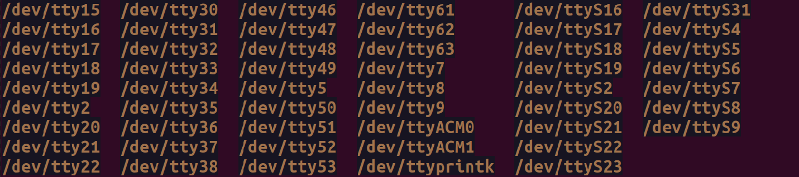
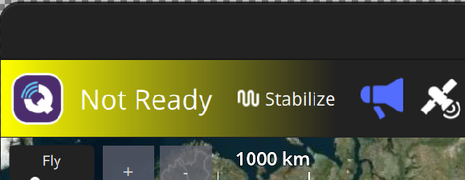
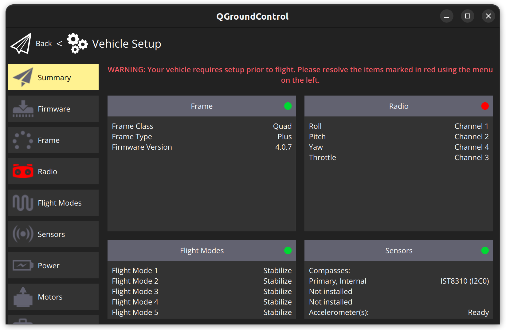
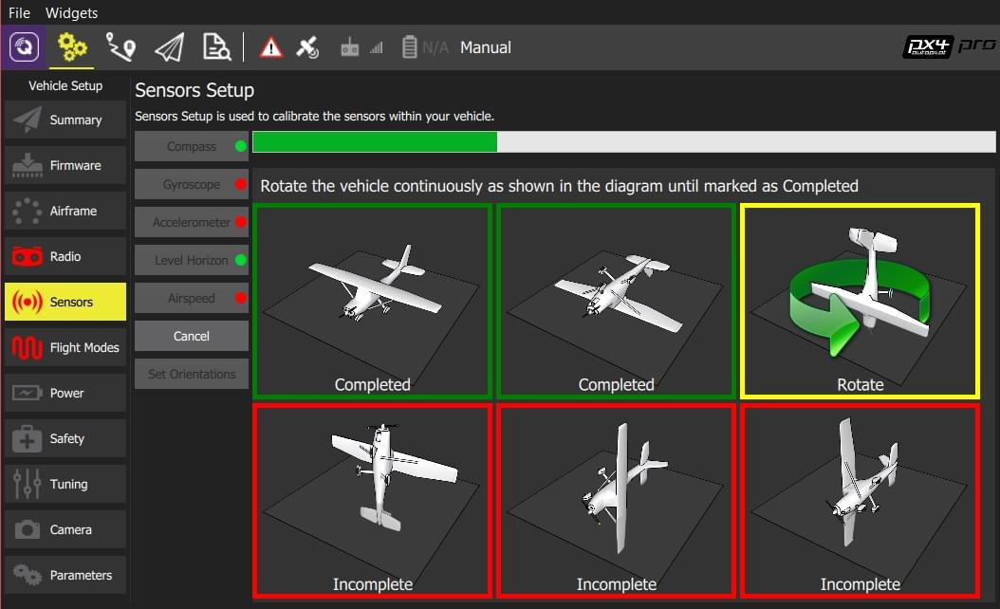
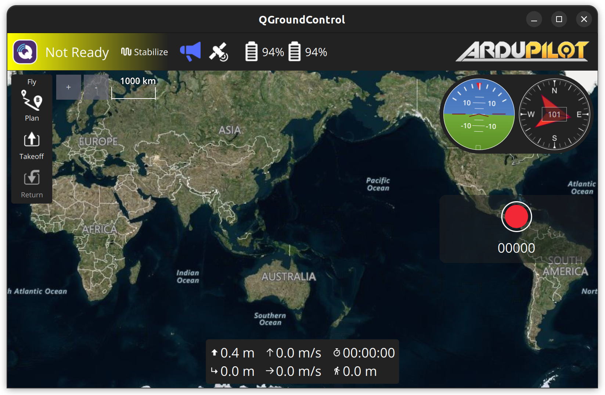
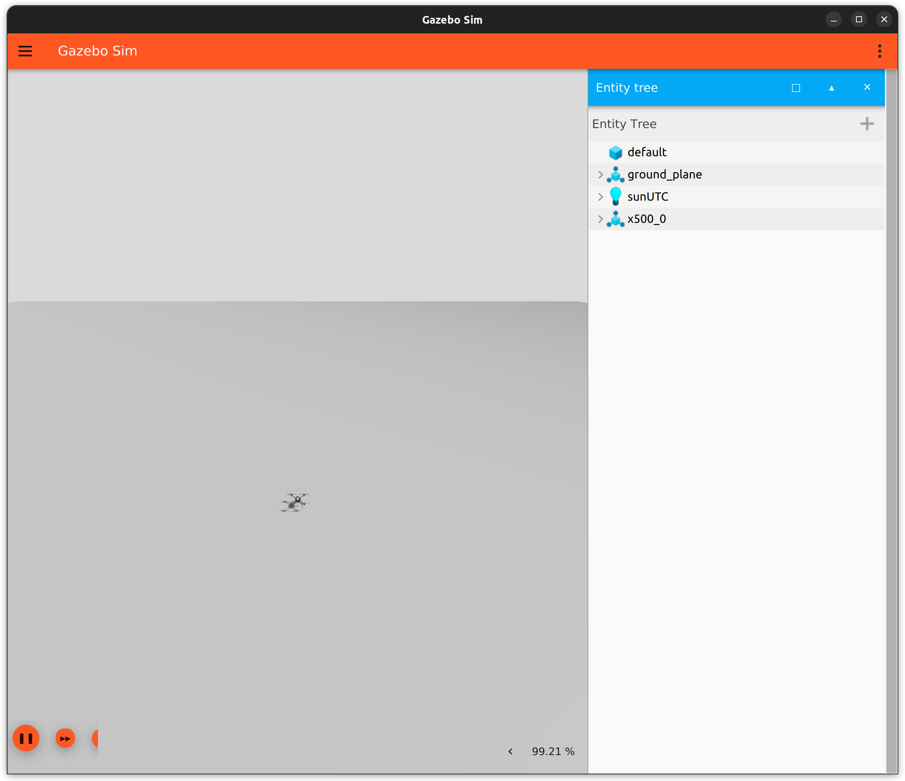
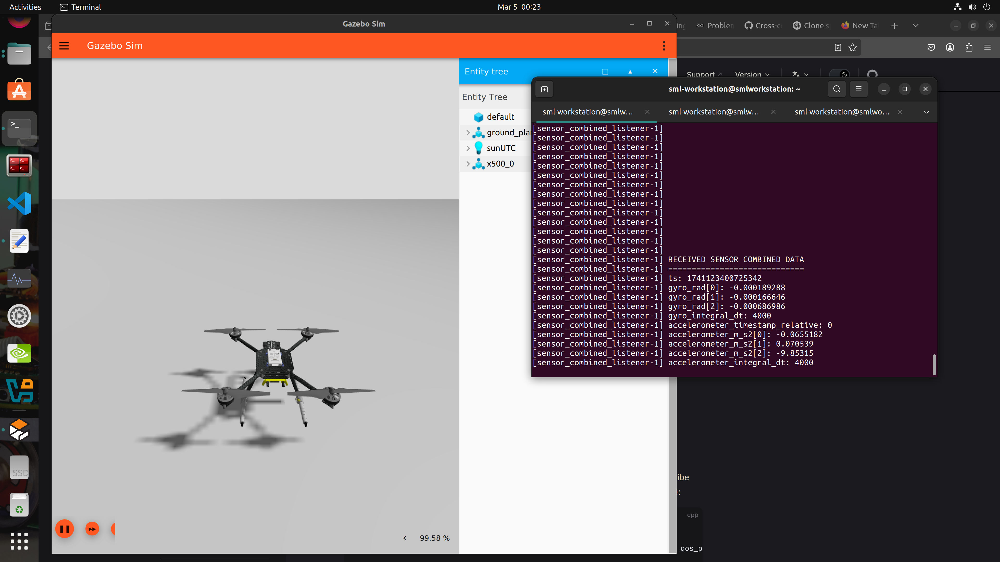
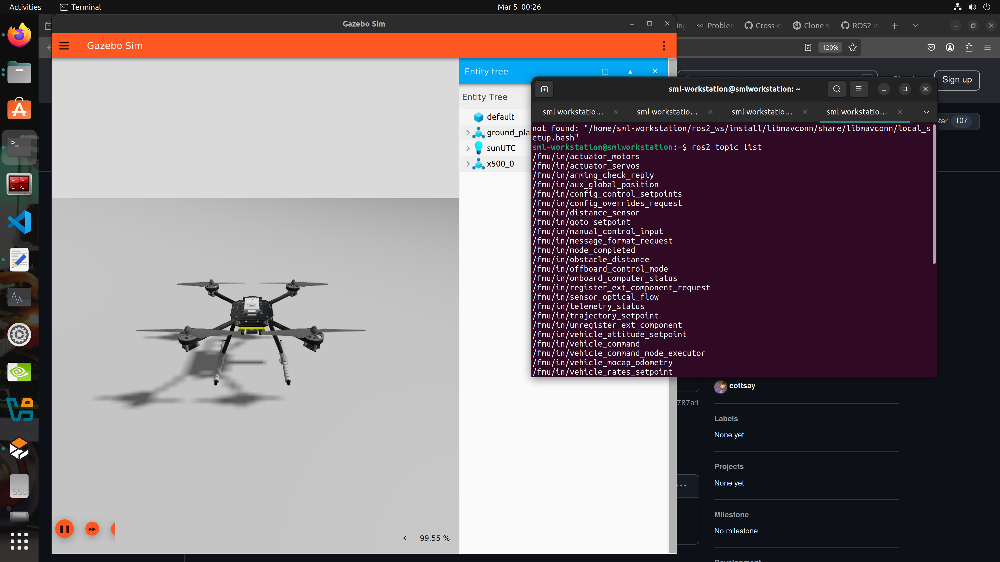
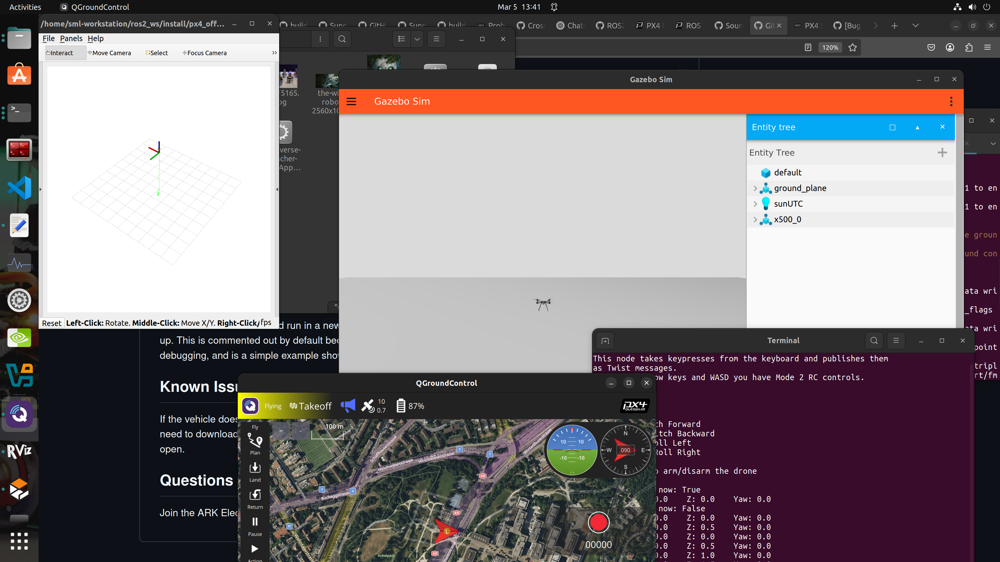
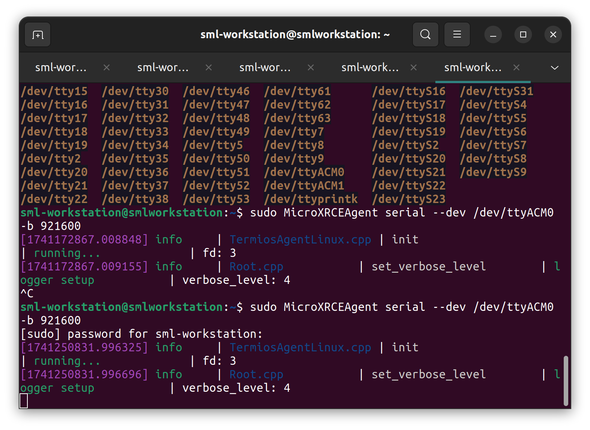

# ros2-px4-pixhawk-guide	

## Overview
This guide documents the setup and troubleshooting process for running PX4 on the Pixhawk V5+ and Pixhawk V6X with ROS 2 (Humble), including both simulation and hardware interfacing via micro-ROS. 
We Stopped at the step of [Starting the Client](#starting-the-client-incomplete) and did not find a solution unfortunately.

## Prerequisites
- Ubuntu 22.04
- Tested on ROS 2 Humble and Gazebo Harmonic
- Hardware used: [CUAV Pixhawk V5+](https://www.cuav.net/en/v5-plus-en/) and [CUAV Pixhawk V6X](https://www.cuav.net/en/v6x-en/)

## 📚 Resources
- [PX4 ROS 2 Docs](https://docs.px4.io/main/en/ros2/)
- [Micro XRCE-DDS Agent](https://micro-xrce-dds.docs.eprosima.com/)
- [QGroundControl Install](https://docs.qgroundcontrol.com/master/en/qgc-user-guide/getting_started/download_and_install.html)

> 📚 **Tip:** If you're new to ROS 2 or Linux, check out the [Command Summary](#-command-summary) at the end of this guide to get familiar with the terminal commands used throughout.

  

## 1. Installing QGroundControl
Following [QGroundControl Install](https://docs.qgroundcontrol.com/master/en/qgc-user-guide/getting_started/download_and_install.html)

1. On the command prompt enter:
```bash
sudo usermod -a -G dialout $USER
sudo apt-get remove modemmanager -y
sudo apt install gstreamer1.0-plugins-bad gstreamer1.0-libav gstreamer1.0-gl -y
sudo apt install libfuse2 -y
sudo apt install libxcb-xinerama0 libxkbcommon-x11-0 libxcb-cursor-dev -y
```
2. Logout and login again to enable the change to user permissions.
3. Download [QGroundControl.AppImage](https://d176tv9ibo4jno.cloudfront.net/latest/QGroundControl.AppImage)
4. Install (and run) using the terminal commands:
```bash
chmod +x ./QGroundControl.AppImage
./QGroundControl.AppImage  (or double click)
```

## 2. Checking Flight Controller Connection
- Connect the flight controller through USB to your device
- Check ports using:
```bash
ls /dev/tty*
```
- Usually you will find 2 extra addresses compared to when the device is not connected:
```bash
/dev/ttyACM1 #Something Similar
/dev/ttyACM0
```


## 3. Calibrating the Flight Controller with QGround Control
1. When Making Sure that your Flight Controller is connected, open QGroundControl.
2. Press the settings tab on the top left on the Q logo.

3. Go to the sensors tab to calibrate your sensors.

4. Follow the steps to calibrate the compass and gyroscope by moving the flight controller in different orientations.

5. Now When you go back you should find the compass and altitude meters on the top right moving when you move your flight controller.



## 4. PX4 ROS2 Integration
I used the [PX4 ROS2 User Guide](https://docs.px4.io/main/en/ros2/user_guide.html) accessed on April 2025 and followed the following steps:

- [Install PX4 Simulator](#1-install-px4-simulator)
- [Install ROS 2](#2-install-ros-2)
- [Setup Micro XRCE-DDS Agent & Client](#3-setup-micro-xrce-dds-agent--client)
- [Build & Run ROS 2 Workspace](#4-build--run-ros-2-workspace)


### 1. Install PX4 Simulator
Set up a PX4 development environment on Ubuntu in the normal way:
```bash
cd
git clone https://github.com/PX4/PX4-Autopilot.git --recursive
bash ./PX4-Autopilot/Tools/setup/ubuntu.sh
cd PX4-Autopilot/
make px4_sitl
```

### 2. Install ROS 2
The instructions  are reproduced from the official installation guide: [Install ROS 2 Humble](https://docs.ros.org/en/humble/Installation/Ubuntu-Install-Debs.html). You can install either the desktop (`ros-humble-desktop`) or bare-bones versions (`ros-humble-ros-base`), and the development tools (`ros-dev-tools`).

Note that if you have already have ros2 installed before px4 to remove it and reinstall it after PX4 simulator, as sometimes this cause problems later.

1. To install ROS 2 "Humble" on Ubuntu 22.04:
```bash
sudo apt update && sudo apt install locales
sudo locale-gen en_US en_US.UTF-8
sudo update-locale LC_ALL=en_US.UTF-8 LANG=en_US.UTF-8
export LANG=en_US.UTF-8
sudo apt install software-properties-common
sudo add-apt-repository universe
sudo apt update && sudo apt install curl -y
sudo curl -sSL https://raw.githubusercontent.com/ros/rosdistro/master/ros.key -o /usr/share/keyrings/ros-archive-keyring.gpg
echo "deb [arch=$(dpkg --print-architecture) signed-by=/usr/share/keyrings/ros-archive-keyring.gpg] http://packages.ros.org/ros2/ubuntu $(. /etc/os-release && echo $UBUNTU_CODENAME) main" | sudo tee /etc/apt/sources.list.d/ros2.list > /dev/null
sudo apt update && sudo apt upgrade -y
sudo apt install ros-humble-desktop
sudo apt install ros-dev-tools
source /opt/ros/humble/setup.bash && echo "source /opt/ros/humble/setup.bash" >> .bashrc
```
2. Some Python dependencies must also be installed (using `pip` or `apt`):
```bash
pip install --user -U empy==3.3.4 pyros-genmsg setuptools
```

### 3. Setup Micro XRCE-DDS Agent & Client
For ROS 2 to communicate with PX4, [uXRCE-DDS](https://docs.px4.io/main/en/modules/modules_system.html#uxrce-dds-client) client must be running on PX4, connected to a micro XRCE-DDS agent running on the companion computer.

#### Setup the Agent
To setup and start the agent:
1. Open a terminal.
2. Enter the following commands to fetch and build the agent from source:
```bash
git clone -b v2.4.2 https://github.com/eProsima/Micro-XRCE-DDS-Agent.git
cd Micro-XRCE-DDS-Agent
mkdir build
cd build
cmake ..
make
sudo make install
sudo ldconfig /usr/local/lib/
```
3. Start the agent with settings for connecting to the uXRCE-DDS client running on the simulator:
```bash
MicroXRCEAgent udp4 -p 8888
```
The agent is now running, but you won't see much until we start PX4 (in the next step).
You can leave the agent running in this terminal! Note that only one agent is allowed per connection channel.
Note that this line is used only to make an agent in simulation but with hardware it will be different

#### Start the Client
The PX4 simulator starts the uXRCE-DDS client automatically, connecting to UDP port 8888 on the local host.

To start the simulator (and client):
1. Open a new terminal in the root of the PX4 Autopilot repo that was installed above.
Start a PX4 Gazebo simulation using:
```bash
make px4_sitl gz_x500
```

The agent and client are now running they should connect.

The PX4 terminal displays the NuttShell/PX4 System Console output as PX4 boots and runs. As soon as the agent connects the output should include INFO messages showing creation of data writers:
```bash
...
INFO  [uxrce_dds_client] synchronized with time offset 1675929429203524us
INFO  [uxrce_dds_client] successfully created rt/fmu/out/failsafe_flags data writer, topic id: 83
INFO  [uxrce_dds_client] successfully created rt/fmu/out/sensor_combined data writer, topic id: 168
INFO  [uxrce_dds_client] successfully created rt/fmu/out/timesync_status data writer, topic id: 188
...
```

The micro XRCE-DDS agent terminal should also start to show output, as equivalent topics are created in the DDS network:
```bash
...
[1675929445.268957] info     | ProxyClient.cpp    | create_publisher         | publisher created      | client_key: 0x00000001, publisher_id: 0x0DA(3), participant_id: 0x001(1)
[1675929445.269521] info     | ProxyClient.cpp    | create_datawriter        | datawriter created     | client_key: 0x00000001, datawriter_id: 0x0DA(5), publisher_id: 0x0DA(3)
[1675929445.270412] info     | ProxyClient.cpp    | create_topic             | topic created          | client_key: 0x00000001, topic_id: 0x0DF(2), participant_id: 0x001(1)
...
```


2. Checking QGroundControl with Simulator
You might find that there is a warning in the gazebo terminal that connection to QGroundControl has failed. To check it is working:
- Open QGroundControl (make sure to disconnect the hardware to have the udp agent connected).
- On the top left in QGroundControl you will find `Take Off` and `Return`.
- When you press `Take Off` you should find the drone flying in simulator.
- When you press `Return` you should find the drone landing in simulator.


### 4. Build & Run ROS 2 Workspace
This section shows how to create a ROS 2 workspace hosted in your home directory (modify the commands as needed to put the source code elsewhere).
- Note that it is advised to make a separate ros workspace for px4 packages, as you will need to build them a lot and delete some files so keep it separate and source it every time. You may also make a `bash` function to enter the workspace, build it, and source it.
- The [px4_ros_com](https://github.com/PX4/px4_ros_com) and [px4_msgs packages](https://github.com/PX4/px4_msgs) are cloned to a workspace folder, and then the `colcon` tool is used to build the workspace. The example is run using `ros2 launch`.
- You should use a version of the px4msgs package with the _same message definitions as the PX4 firmware you have installed in the step above. Branches in the px4_msgs repo are named to correspond to the message definitions for different PX4 releases. If for any reason you cannot ensure the same message definitions between your PX4 firmware and ROS 2 px4_msgs package, you will additionally need to [start the message translation node](https://docs.px4.io/main/en/ros2/user_guide.html#optional-starting-the-translation-node) as part of your setup process. (I did not need to do this)
- The example builds the [ROS 2 Listener](https://docs.px4.io/main/en/ros2/user_guide.html#ros-2-listener) example application, located in [px4_ros_com](https://github.com/PX4/px4_ros_com). [px4_msgs](https://github.com/PX4/px4_msgs) is needed too so that the example can interpret PX4 ROS 2 topics.

#### Building the Workspace
To create and build the workspace:
1. Open a new terminal.
2. Create and navigate into a new workspace directory using:
```bash
mkdir -p ~/ws_sensor_combined/src/
cd ~/ws_sensor_combined/src/
```
> **Info:** You can use any name instead of `ws_sensor_combined` for your workspace.

3. Clone the example repository and [px4_msgs](https://github.com/PX4/px4_msgs) to the `/src` directory (the `main` branch is cloned by default, which corresponds to the version of PX4 we are running):
```bash
git clone https://github.com/PX4/px4_msgs.git
git clone https://github.com/PX4/px4_ros_com.git
```
4. Source the ROS 2 development environment into the current terminal and compile the workspace using `colcon`:
```bash
cd ..
source /opt/ros/humble/setup.bash
colcon build
```
This builds all the folders under `/src` using the sourced toolchain.

> **Info:** Note that bulding `px4_msgs` takes some time to finish.

##### px4_msgs build problem
When Building the workspace the `px4_msgs` would not build with such error:
```bash
-- stderr: px4_msgs                               
Traceback (most recent call last):
  File "/home/sml-workstation/ros2_ws/build/px4_msgs/ament_cmake_python/px4_msgs/setup.py", line 4, in <module>
    setup(
  File "/home/sml-workstation/.local/lib/python3.10/site-packages/setuptools/__init__.py", line 117, in setup
    return distutils.core.setup(**attrs)
  File "/home/sml-workstation/.local/lib/python3.10/site-packages/setuptools/_distutils/core.py", line 186, in setup
    return run_commands(dist)
  File "/home/sml-workstation/.local/lib/python3.10/site-packages/setuptools/_distutils/core.py", line 202, in run_commands
    dist.run_commands()
  File "/home/sml-workstation/.local/lib/python3.10/site-packages/setuptools/_distutils/dist.py", line 983, in run_commands
    self.run_command(cmd)
  File "/home/sml-workstation/.local/lib/python3.10/site-packages/setuptools/dist.py", line 999, in run_command
    super().run_command(command)
  File "/home/sml-workstation/.local/lib/python3.10/site-packages/setuptools/_distutils/dist.py", line 1002, in run_command
    cmd_obj.run()
  File "/home/sml-workstation/.local/lib/python3.10/site-packages/setuptools/command/egg_info.py", line 312, in run
    self.find_sources()
  File "/home/sml-workstation/.local/lib/python3.10/site-packages/setuptools/command/egg_info.py", line 320, in find_sources
    mm.run()
  File "/home/sml-workstation/.local/lib/python3.10/site-packages/setuptools/command/egg_info.py", line 548, in run
    self.prune_file_list()
  File "/home/sml-workstation/.local/lib/python3.10/site-packages/setuptools/command/sdist.py", line 162, in prune_file_list
    super().prune_file_list()
  File "/home/sml-workstation/.local/lib/python3.10/site-packages/setuptools/_distutils/command/sdist.py", line 380, in prune_file_list
    base_dir = self.distribution.get_fullname()
  File "/home/sml-workstation/.local/lib/python3.10/site-packages/setuptools/_core_metadata.py", line 272, in get_fullname
    return _distribution_fullname(self.get_name(), self.get_version())
  File "/home/sml-workstation/.local/lib/python3.10/site-packages/setuptools/_core_metadata.py", line 290, in _distribution_fullname
    canonicalize_version(version, strip_trailing_zero=False),
TypeError: canonicalize_version() got an unexpected keyword argument 'strip_trailing_zero'
gmake[2]: *** [CMakeFiles/ament_cmake_python_build_px4_msgs_egg.dir/build.make:70: CMakeFiles/ament_cmake_python_build_px4_msgs_egg] Error 1
gmake[1]: *** [CMakeFiles/Makefile2:447: CMakeFiles/ament_cmake_python_build_px4_msgs_egg.dir/all] Error 2
gmake[1]: *** Waiting for unfinished jobs....
gmake: *** [Makefile:146: all] Error 2
---
Failed   <<< px4_msgs [26.7s, exited with code 2]
```

This is The solution that worked with me:
- Try to check your current version of packaging:
```bash
pip list | grep packaging
```
- if the version of packaging is <22.0, please upgrade it to 22.0
```bash
pip install packaging==22.0
```
- Then, remove log, build and install folders in the workspace and colcon build again.
```bash
cd ws_sensor_combined
sudo rm -rf  rm -rf ./build ./install ./log
colcon build
source install/setup.bash
```
- Generally the build problem may happen again when rebuilding, so generally remove these files if it failed again.
- These are some useful resources that helped me debug the issue: [px4_msgs](https://github.com/PX4/px4_msgs), [build problem github issue](https://github.com/PX4/PX4-Autopilot/issues/21128), [px4-issue](https://discuss.px4.io/t/px4-to-ros2-connection-does-not-work/31275/)

### Running the Example
To run the executables that you just built, you need to source `local_setup.bash`. This provides access to the "environment hooks" for the current workspace. In other words, it makes the executables that were just built available in the current terminal.
> **Info:** The [ROS2 beginner tutorials](https://docs.ros.org/en/humble/Tutorials/Beginner-Client-Libraries/Creating-A-Workspace/Creating-A-Workspace.html#source-the-overlay) recommend that you open a new terminal for running your executables.

In a new terminal:
1. Navigate into the top level of your workspace directory and source the ROS 2 environment (in this case "Humble"):
```bash
cd ~/ws_sensor_combined/
source /opt/ros/humble/setup.bash
```
- you can also put the `source` command of ROS humble by putting this command in the `bashrc` file as you will always use it
```bash 
gedit ~/.bashrc
``` 
- Scroll to the bottom and add your command:
```bash
source /opt/ros/humble/setup.bash
```
2. Source the `local_setup.bash`
```bash
source install/local_setup.bash
```
3. Now launch the example. Note here that we use `ros2 launch`, which is described below.
```bash
ros2 launch px4_ros_com sensor_combined_listener.launch.py
```
If this is working you should see data being printed on the terminal/console where you launched the ROS listener:
```bash
RECEIVED DATA FROM SENSOR COMBINED
================================
ts: 870938190
gyro_rad[0]: 0.00341645
gyro_rad[1]: 0.00626475
gyro_rad[2]: -0.000515705
gyro_integral_dt: 4739
accelerometer_timestamp_relative: 0
accelerometer_m_s2[0]: -0.273381
accelerometer_m_s2[1]: 0.0949186
accelerometer_m_s2[2]: -9.76044
accelerometer_integral_dt: 4739
```




#### Problem: `local_setub.bash` is not found 
If you faced such a problem after bulding the workspace and trying to `source` it with such error:
```bash
"l-workstation@smlworkstation:~/ros2_ws$ source /opt/ros/humble/setup.bash
sml-workstation@smlworkstation:~/ros2_ws$ ros2 launch px4_ros_com sensor_combined_listener.launch.py
Package 'px4_ros_com' not found: "package 'px4_ros_com' not found, searching: ['/opt/ros/humble']"
sml-workstation@smlworkstation:~/ros2_ws$ source install/local_setup.bash
not found: "/home/sml-workstation/ros2_ws/install/libmavconn/share/libmavconn/local_setup.bash"
sml-workstation@smlworkstation:~/ros2_ws$ cd
sml-workstation@smlworkstation:~$ source install/local_setup.bash
bash: install/local_setup.bash: No such file or directory
"
```
This is a common error in ROS2. The fix is very simple, to compile the workspace from scratch.

Use the following commands:
```bash
cd ~/ws_sensor_combined
rm -rf ./build ./install ./log
colcon build
source install/setup.bash
```
After executing the above 4 commands, you should be able to launch your desired ROS2 program without any issue.

Also you might face some problems while rebuilding the workspace with such warnings:
```bash
colcon build
[0.135s] WARNING:colcon.colcon_ros.prefix_path.ament:The path '/home/sml-workstation/ros2_ws/install/px4_ros_com' in the environment variable AMENT_PREFIX_PATH doesn't exist
[0.135s] WARNING:colcon.colcon_ros.prefix_path.ament:The path '/home/sml-workstation/ros2_ws/install/example_mode_with_executor_cpp' in the environment variable AMENT_PREFIX_PATH doesn't exist
[0.135s] WARNING:colcon.colcon_ros.prefix_path.ament:The path '/home/sml-workstation/ros2_ws/install/example_mode_rtl_replacement_cpp' in the environment variable AMENT_PREFIX_PATH doesn't exist
[0.135s] WARNING:colcon.colcon_ros.prefix_path.ament:The path '/home/sml-workstation/ros2_ws/install/example_mode_manual_cpp' in the environment variable AMENT_PREFIX_PATH doesn't exist
[0.135s] WARNING:colcon.colcon_ros.prefix_path.ament:The path '/home/sml-workstation/ros2_ws/install/example_mode_goto_global_cpp' in the environment variable AMENT_PREFIX_PATH doesn't exist
[0.135s] WARNING:colcon.colcon_ros.prefix_path.ament:The path '/home/sml-workstation/ros2_ws/install/example_mode_goto_cpp' in the environment variable AMENT_PREFIX_PATH doesn't exist
[0.135s] WARNING:colcon.colcon_ros.prefix_path.ament:The path '/home/sml-workstation/ros2_ws/install/example_mode_fw_attitude_cpp' in the environment variable AMENT_PREFIX_PATH doesn't exist
[0.135s] WARNING:colcon.colcon_ros.prefix_path.ament:The path '/home/sml-workstation/ros2_ws/install/example_local_navigation_cpp' in the environment variable AMENT_PREFIX_PATH doesn't exist
[0.135s] WARNING:colcon.colcon_ros.prefix_path.ament:The path '/home/sml-workstation/ros2_ws/install/example_global_navigation_cpp' in the environment variable AMENT_PREFIX_PATH doesn't exist
[0.135s] WARNING:colcon.colcon_ros.prefix_path.ament:The path '/home/sml-workstation/ros2_ws/install/example_executor_with_multiple_modes_cpp' in the environment variable AMENT_PREFIX_PATH doesn't exist
[0.135s] WARNING:colcon.colcon_ros.prefix_path.ament:The path '/home/sml-workstation/ros2_ws/install/px4_ros2_cpp' in the environment variable AMENT_PREFIX_PATH doesn't exist
[0.135s] WARNING:colcon.colcon_ros.prefix_path.ament:The path '/home/sml-workstation/ros2_ws/install/px4_offboard' in the environment variable AMENT_PREFIX_PATH doesn't exist
[0.135s] WARNING:colcon.colcon_ros.prefix_path.ament:The path '/home/sml-workstation/ros2_ws/install/px4_msgs' in the environment variable AMENT_PREFIX_PATH doesn't exist
[0.135s] WARNING:colcon.colcon_ros.prefix_path.catkin:The path '/home/sml-workstation/ros2_ws/install/px4_ros_com' in the environment variable CMAKE_PREFIX_PATH doesn't exist
[0.135s] WARNING:colcon.colcon_ros.prefix_path.catkin:The path '/home/sml-workstation/ros2_ws/install/example_mode_with_executor_cpp' in the environment variable CMAKE_PREFIX_PATH doesn't exist
[0.135s] WARNING:colcon.colcon_ros.prefix_path.catkin:The path '/home/sml-workstation/ros2_ws/install/example_mode_rtl_replacement_cpp' in the environment variable CMAKE_PREFIX_PATH doesn't exist
[0.135s] WARNING:colcon.colcon_ros.prefix_path.catkin:The path '/home/sml-workstation/ros2_ws/install/example_mode_manual_cpp' in the environment variable CMAKE_PREFIX_PATH doesn't exist
[0.135s] WARNING:colcon.colcon_ros.prefix_path.catkin:The path '/home/sml-workstation/ros2_ws/install/example_mode_goto_global_cpp' in the environment variable CMAKE_PREFIX_PATH doesn't exist
[0.135s] WARNING:colcon.colcon_ros.prefix_path.catkin:The path '/home/sml-workstation/ros2_ws/install/example_mode_goto_cpp' in the environment variable CMAKE_PREFIX_PATH doesn't exist
[0.135s] WARNING:colcon.colcon_ros.prefix_path.catkin:The path '/home/sml-workstation/ros2_ws/install/example_mode_fw_attitude_cpp' in the environment variable CMAKE_PREFIX_PATH doesn't exist
[0.135s] WARNING:colcon.colcon_ros.prefix_path.catkin:The path '/home/sml-workstation/ros2_ws/install/example_local_navigation_cpp' in the environment variable CMAKE_PREFIX_PATH doesn't exist
[0.135s] WARNING:colcon.colcon_ros.prefix_path.catkin:The path '/home/sml-workstation/ros2_ws/install/example_global_navigation_cpp' in the environment variable CMAKE_PREFIX_PATH doesn't exist
[0.135s] WARNING:colcon.colcon_ros.prefix_path.catkin:The path '/home/sml-workstation/ros2_ws/install/example_executor_with_multiple_modes_cpp' in the environment variable CMAKE_PREFIX_PATH doesn't exist
[0.136s] WARNING:colcon.colcon_ros.prefix_path.catkin:The path '/home/sml-workstation/ros2_ws/install/px4_ros2_cpp' in the environment variable CMAKE_PREFIX_PATH doesn't exist
[0.136s] WARNING:colcon.colcon_ros.prefix_path.catkin:The path '/home/sml-workstation/ros2_ws/install/px4_msgs' in the environment variable CMAKE_PREFIX_PATH doesn't exist
Starting >>> px4_msgs
[Processing: px4_msgs]                              
[Processing: px4_msgs]                                      
[Processing: px4_msgs]                                        
Finished <<< px4_msgs [1min 44s]                               
Starting >>> px4_ros2_cpp
Starting >>> px4_offboard
Starting >>> px4_ros_com
/home/sml-workstation/.local/lib/python3.10/site-packages/setuptools/_distutils/dist.py:270: UserWarning: Unknown distribution option: 'tests_require'
  warnings.warn(msg)
--- stderr: px4_offboard                                                
/home/sml-workstation/.local/lib/python3.10/site-packages/setuptools/_distutils/dist.py:270: UserWarning: Unknown distribution option: 'tests_require'
  warnings.warn(msg)
---
Finished <<< px4_offboard [0.79s]
Finished <<< px4_ros_com [10.1s]                                             
Finished <<< px4_ros2_cpp [26.2s]                             
Starting >>> example_executor_with_multiple_modes_cpp
Starting >>> example_global_navigation_cpp
Starting >>> example_local_navigation_cpp
Starting >>> example_mode_fw_attitude_cpp
Starting >>> example_mode_goto_cpp
Starting >>> example_mode_goto_global_cpp
Starting >>> example_mode_manual_cpp
Starting >>> example_mode_rtl_replacement_cpp
Starting >>> example_mode_with_executor_cpp
Finished <<< example_local_navigation_cpp [4.42s]
Finished <<< example_global_navigation_cpp [4.49s]
Finished <<< example_mode_fw_attitude_cpp [4.63s]
Finished <<< example_mode_with_executor_cpp [4.72s]
Finished <<< example_executor_with_multiple_modes_cpp [4.98s]
Finished <<< example_mode_manual_cpp [4.97s]
Finished <<< example_mode_goto_cpp [5.41s]   
Finished <<< example_mode_goto_global_cpp [5.43s]
Finished <<< example_mode_rtl_replacement_cpp [8.77s]

Summary: 13 packages finished [2min 19s]
  1 package had stderr output: px4_offboard

```

You Can solve such warnings with again: 
```bash
cd ~/ws_sensor_combined
rm -rf ./build ./install ./log
colcon build
source install/setup.bash
```

#### (Optional.....)

#### (Optional) PX4_off_board Example
This is an extra example to play a bit with the simulation that should control the drone via the keyboard in gazebo. Following this [tutorial video](https://www.youtube.com/watch?v=8gKIP0OqHdQ) and its corresponding [github repo](https://github.com/ARK-Electronics/ROS2_PX4_Offboard_Example).

Setup Steps:
- This is after all the above steps of installing px4 and the `Micro-XRCE-DDS-Agent` and `px4_msgs`
- Python dependencies:
```bash
pip3 install kconfiglib
pip install --user jsonschema
pip install --user jinja2
```
- Clone the package:
```bash
cd ws_sensor_combined/src
git clone https://github.com/ARK-Electronics/ROS2_PX4_Offboard_Example.git
source /opt/ros/humble/setup.bash
cd ..
colcon build
source install/setup.bash
```
Running the code:
```bash
ros2 launch px4_offboard offboard_velocity_control.launch.py
```

This will run numerous things. In no particular order, it will run:

- processes.py in a new window
  - MicroDDS in a new terminal window
  - Gazebo will open in a second tab in the same terminal window
    - Gazebo GUI will open in it's own window
- control.py in a new window
  - Sends ROS2 Teleop commands to the /offboard_velocity_cmd topic based on keyboard input
- RVIZ will open in a new window
- velocity_control.py runs as it's own node, and is the main node of this example

Once everything is running, you should be able to focus into the control.py terminal window, arm, and takeoff. The controls mimic Mode 2 RC Transmitter controls with WASD being the left joystick and the arrow keys being the right joystick. The controls are as follows:

- W: Up
- S: Down
- A: Yaw Left
- D: Yaw Right
- Up Arrow: Pitch Forward
- Down Arrow: Pitch Backward
- Left Arrow: Roll Left
- Right Arrow: Roll Right
- Space: Arm/Disarm

Pressing Space will arm the drone. Wait a moment and it will takeoff and switch into offboard mode. You can now control it using the above keys. If you land the drone, it will disarm and to takeoff again you will need to toggle the arm switch off and back on with the space bar.

Using the controls, click W to send a vertical veloctiy command and take off. Once in the air you can control it as you see fit.

When closing the simulation, it is very tempting to just close the terminal windows. However, this will leave Gazebo running in the background, potentially causing issues when you run Gazebo in the future. To correctly end the Gazebo simulation, go to it's terminal window and click Ctrl+C. This will close Gazebo and all of it's child processes. Then, you can close the other terminal windows.



**For Me I could not get the keyboard control to do anything and I followed all the steps, but when I `Take Off` in QGroundControl the drone flies**.


---

## Using Flight Controller Hardware with ROS
ROS 2 with PX4 running on a flight controller is almost the same as working with PX4 on the simulator. The only difference is that you need to start both the agent and the client, with settings appropriate for the communication channel.

### Starting the Serial Agent
From [PX4-UXRCE-DDS Gudie](https://docs.px4.io/main/en/middleware/uxrce_dds.html#starting-agent-and-client): "The agent is used to connect to the client over a particular channel, such as UDP or a serial connection. The channel settings are specified when the agent is started, using command line options. These are documented in the eProsima user guide: [Micro XRCE-DDS Agent > Agent CLI](https://micro-xrce-dds.docs.eprosima.com/en/latest/agent.html#agent-cli). Note that the agent supports many channel options, but PX4 only supports UDP and serial connections."

For example, the PX4 simulator runs the uXRCE-DDS client over UDP on port 8888, so to connect to the simulator you would start the agent with the command:
```bash
MicroXRCEAgent udp4 -p 8888
```

When working with real hardware, the setup depends on the hardware, OS, and channel. For example if you are using Serial: 
```bash
sudo MicroXRCEAgent serial --dev /dev/ACM0 -b 921600 # Replace ACM0 with port Address
```
We were succesful in starting the agent.


For more information about setting up communications channels see Pixhawk + Companion Setup > Serial Port setup, and sub-documents.

> **Info:** or more information about setting up communications channels see [Pixhawk + Companion Setup > Serial Port setup](https://docs.px4.io/main/en/companion_computer/pixhawk_companion.html#serial-port-setup), and sub-documents.

### Editing the sensor_combined_listener launch file
After Starting the Serial Agent, We Tried to start the same [listener launch file] ([sensor_combined_listener.launch.py](https://github.com/PX4/px4_ros_com/blob/main/launch/sensor_combined_listener.launch.py)) in which we found the code as follows:
``` python
from launch import LaunchDescription
from launch_ros.actions import Node
from launch.actions import ExecuteProcess

def generate_launch_description():

    micro_ros_agent = ExecuteProcess(
        cmd=[[
            'micro-ros-agent udp4 --port 8888 -v '
        ]],
        shell=True
    )

    sensor_combined_listener_node = Node(
        package='px4_ros_com',
        executable='sensor_combined_listener',
        output='screen',
        shell=True,
    )

    return LaunchDescription([
        #micro_ros_agent,
        sensor_combined_listener_node
    ])
```
We tried to replace:
```python
'micro-ros-agent udp4 --port 8888 -v '
```
With:
```python
MicroXRCEAgent serial --dev /dev/ACM0 -b 921600
```
Or:
```python
micro-ros-agent --dev /dev/ACM0 -b 921600
```

But failed to see any ros topics when the launch file is being run. We found that the problem is that in simulation the `UDP` Clinet is started automatically via MAVlink, and we need to start the client in a different way.


### Starting the Client (Incomplete)
We Tried proceeding with several steps but failed t find one succsful solution, so here it is more of a discussion of some information that might be helpful.

#### Using [This PX4-DDS Gudie](https://docs.px4.io/main/en/middleware/uxrce_dds.html#starting-agent-and-client):
The configuration can be done using the [UXRCE-DDS parameters](https://docs.px4.io/main/en/advanced_config/parameter_reference.html#uxrce-dds-client):
- UXRCE_DDS_CFG: Set the port to connect on, such as `TELEM2`, `Ethernet`, or `Wifi`.
- If using an Serial Connection:
  - [SER_TEL2_BAUD](https://docs.px4.io/main/en/advanced_config/parameter_reference.html#SER_TEL2_BAUD), [SER_URT6_BAUD](https://docs.px4.io/main/en/advanced_config/parameter_reference.html#SER_URT6_BAUD) (and so on): Use the `_BAUD` parameter associated with the serial port to set the baud rate. For example, you'd set a value for `SER_TEL2_BAUD` if you are connecting to the companion using `TELEM2`. For more information see [Serial port configuration](https://docs.px4.io/main/en/peripherals/serial_configuration.html#serial-port-configuration).
- Many ports are already have a default configuration. To use these ports you must first disable the existing configuration:
  - `TELEM1` and `TELEM2` are set up by default to connect via MAVLink to a GCS and a companion computer (respectively). Disable by setting [MAV_0_CONFIG=0](https://docs.px4.io/main/en/advanced_config/parameter_reference.html#MAV_0_CONFIG) or [MAV_1_CONFIG=0](https://docs.px4.io/main/en/advanced_config/parameter_reference.html#MAV_1_CONFIG) to zero. See [MAVLink Peripherals](https://docs.px4.io/main/en/peripherals/mavlink_peripherals.html) for more information.
  - **Actually This point is one of the clues to solving disabling the MAVLink automatic client**
- Once set, you may need to reboot PX4 for the parameters to take effect. They will then persist through subsequent reboots.
  
You can also start the [uxrce_dds_client]() using a command line. This can be called as part of [System Startup]() or through the MAVLink Shell (or a system console). This method is useful when you need to set a custom client namespace, as no parameter is provided for this purpose. For example, the following command can be used to connect via Ethernet to a remote host at `192.168.0.100:8888` and to set the client namespace to `/drone/`.
```bash
uxrce_dds_client start -t udp -p 8888 -h 192.168.0.100 -n drone
```
Options `-p` or `-h` are used to bypass `UXRCE_DDS_PRT` and `UXRCE_DDS_AG_IP`.

**We Tried to use this command but didn't find the `uxrce_dds_client_start` command**

Also we tried to see if any similar commands can be found with `MicroXRCEAgent` but did not find clues to this:
```bash
MicroXRCEAgent -h
	Usage: 'MicroXRCEAgent <udp4|udp6|tcp4|tpc6|canfd|serial|multiserial|pseudoterminal> <<args>>'

	Available arguments (per transport):
	  * COMMON
	    -h/--help.
	    -m/--middleware <value> (ced, dds, rtps) [default: 'dds'].
	    -r/--refs <value>.
	    -v/--verbose <value> ( - ) [default: ''].
	    -d/--discovery <value> [default: '7400'].
	    -P/--p2p <value>.
	  * IPvX (udp4, udp6, tcp4, tcp6)
	    -p/--port <value>.
	  * SERIAL (serial, multiserial, pseudoterminal)
	    -b/--baudrate <value> [default: '115200'].
	    -D/--dev <value>.  * CAN FD (canfd)
	    -D/--dev <value>.

```

### Ideas to Proceed with Solving the Client Problem


### Useful Resources in Hardware-ROS Communication
- [uXRCE-DDS (PX4-ROS 2/DDS Bridge)](https://docs.px4.io/main/en/middleware/uxrce_dds.html#starting-agent-and-client)
- [uxrce_dds_client](https://docs.px4.io/main/en/modules/modules_system.html#uxrce-dds-client)
- [Serial Port Configuration](https://docs.px4.io/main/en/peripherals/serial_configuration.html#serial-port-configuration)
- [Using a Companion Computer with Pixhawk Controllers](https://docs.px4.io/main/en/companion_computer/pixhawk_companion.html#serial-port-setup)
- [MAVLink Peripherals (GCS/OSD/Companion)](https://docs.px4.io/main/en/peripherals/mavlink_peripherals.html)
- [Serial Port Mapping](https://docs.px4.io/main/en/hardware/serial_port_mapping.html)	
- [Micro-XRCE-DDS-Agent Source Code](https://github.com/eProsima/Micro-XRCE-DDS-Agent/tree/master)
- [Micro-XRCE-DDS Documentation](https://micro-xrce-dds.docs.eprosima.com/en/latest/introduction.html)
- [Micro-XRCE-DDS Client Documentation](https://micro-xrce-dds.docs.eprosima.com/en/latest/client.html)
- [PX4 Architectural Overview](https://docs.px4.io/main/en/concept/architecture.html)
- [MAVROS](https://github.com/mavlink/mavros/blob/ros2/mavros/README.md)
- [Connecting Pixhwak with ROS using Mavros | HWRS 4](https://www.youtube.com/watch?v=e3Ev4LYxzPk)
- [How to connect Pixhawk 6c Drone to Raspberry Pi | Mavlink | Ardupilot | Mission Planner | PX4](https://www.youtube.com/watch?v=u-NOD0PegwA)


---

## 📋 Command Summary
### 🧾 Basic Linux Commands
#### Project Specific
- `lsusb` — List connected USB devices
- `dmesg | grep -i usb` — Show kernel logs related to USB
- `lsblk` — List block devices
- `ls /dev/tty*` — Show available serial ports
- `sudo usermod -a -G dialout $USER` — Add user to dialout group for serial access
- `sudo apt install <package>` — Install system packages
- `rm -rf build/ install/ log/` — Clean ROS 2 workspace

#### General
- `ls` — List files and directories
- `cd <dir>` — Change directory
- `pwd` — Print working directory
- `mkdir <dir>` — Create a new directory
- `rm <file>` — Remove a file
- `rm -rf <dir>` — Force delete a directory and its contents
- `cp <src> <dst>` — Copy files or directories
- `mv <src> <dst>` — Move or rename files
- `cat <file>` — Print the contents of a file
- `less <file>` — View file content one page at a time
- `grep <pattern> <file>` — Search for a pattern in a file
- `chmod +x <file>` — Make a file executable
- `ps aux | grep <name>` — List processes containing a string
- `kill <pid>` — Kill a process by PID
- `sudo` — Execute command with superuser privileges
- `history` — Show command history
- `top` or `htop` — View system resource usage
- `df -h` — Show disk usage
- `du -sh <dir>` — Show size of a directory
- `uname -a` — Show system information
- `ifconfig` / `ip a` — Show network interfaces
- `ping <host>` — Check network connection
- `nano <file>` — Open file in nano editor
- `code <file>` — Open file in VS Code (if installed)
- `lsusb` — List connected USB devices
- `dmesg | grep -i usb` — Show kernel logs related to USB
- `lsblk` — List block devices
- `ls /dev/tty*` — Show available serial/tty ports
- `sudo apt install <package>` — Install a system package

- 
### 🛠️ ROS 2 Build & Source

#### 📦 Workspace & Build
- `colcon build` — Build the current ROS 2 workspace
- `source install/setup.bash` — Source the workspace after building
- `source /opt/ros/humble/setup.bash` — Source system-wide ROS 2 installation
- `rosdep install --from-paths src --ignore-src -r -y` — Install package dependencies


#### 🚀 Run & Launch Nodes
- `ros2 run <package_name> <executable>` — Run a single node from a package
- `ros2 launch <package_name> <launch_file.launch.py>` — Run a launch file


#### 🧵 Topics
- `ros2 topic list` — List all active topics
- `ros2 topic echo <topic_name>` — Print messages from a topic
- `ros2 topic info <topic_name>` — Get info about a topic (type, publisher count, etc.)
- `ros2 topic pub <topic> <msg_type> <data>` — Publish a message manually

  Example:
  ```bash
  ros2 topic pub /chatter std_msgs/msg/String "{data: 'hello'}"
  ```

### 🚀 PX4 & Micro XRCE-DDS Commands
- `make px4_sitl gz_x500` — Start PX4 simulation with Gazebo model `x500`
- `sudo MicroXRCEAgent serial --dev /dev/ttyACM0 -b 921600` — Start agent on serial
- `MicroXRCEAgent udp4 -p 8888` — Start agent on UDP port 8888

### 🧪 Python Environment Fixes
- `pip list | grep packaging` — Check packaging library version
- `pip install packaging==22.0` — Fix compatibility issue with `px4_msgs` build

### 📦 Git Commands
- `git clone <repo_url>` — Clone a GitHub repo
- `git clone --recursive <repo_url>` — Clone and initialize submodules

   
